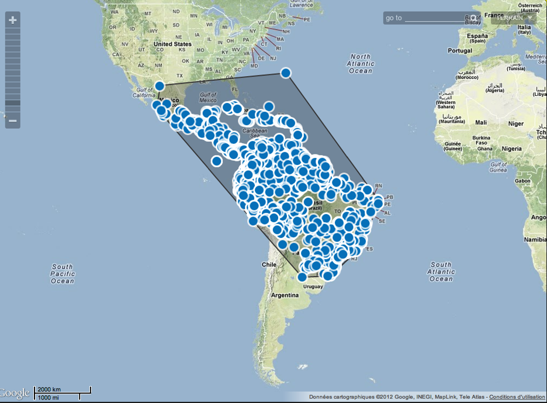
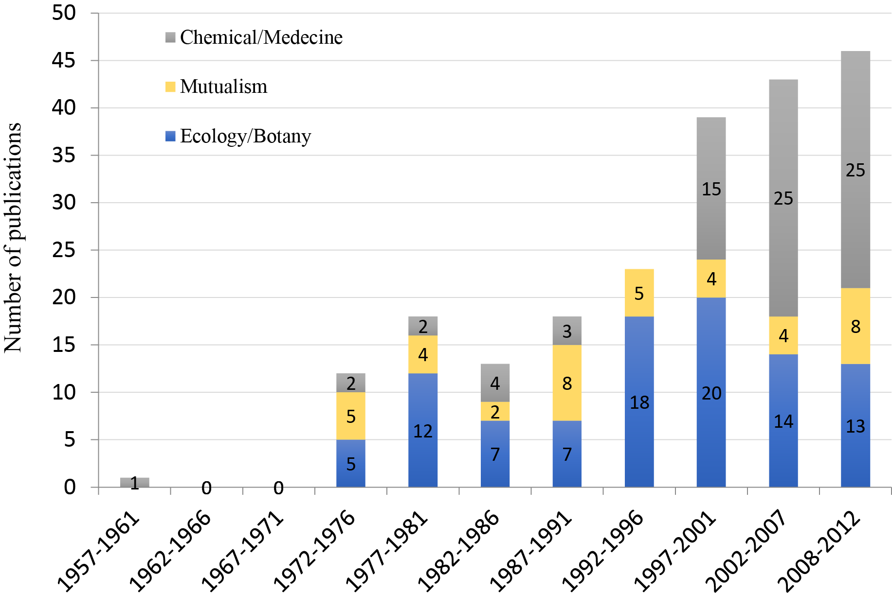
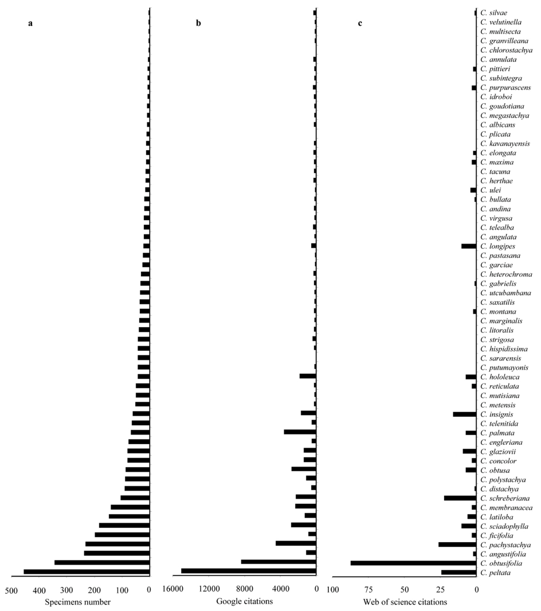

# Introduction {#intro}
```{r global_options, include=FALSE}
knitr::opts_chunk$set(fig.pos = 'H', fig.align = 'center')
```
Ce travail s’est déroulé du 15/02/2012 au 15/06/2012 à l’Unité Mixte de Recherche « Ecologie des forêts de Guyane » (ECOFOG) en Guyane française qui dépend de 5 tutelles : AgroParisTech (745), l’INRA (745), le CNRS (8172), le CIRAD (93) et l’Université Antilles-Guyane (43). ECOFOG fait partie du laboratoire d’excellence « Centre d’Etude de la Biodiversité Amazonienne (Labex CEBA) » qui réunit un ensemble d’acteurs de la recherche et de l’enseignement supérieur en Guyane, aux Antilles et en métropole, autour d’un contenu scientifique d’excellence sur le thème de la biodiversité amazonienne : environnement, écologie, biodiversité, santé et écotechnologie. Ce travail a bénéficié d'une aide de l’Etat gérée par l'Agence Nationale de la Recherche au titre du programme Investissements d’avenir portant la référence ANR-10-LABX-0025

*Cecropia* Loefl. est un des genres les plus emblématique des néotropiques [@Berg2005]. Il regroupe des espèces d’arbres pionniers qui colonisent les chablis forestiers ainsi que les zones déboisées et défrichées pleinement exposées à la lumière. *Cecropia spp.* se distribuent naturellement du sud du Mexique jusqu’au nord de l'Argentine ainsi qu’aux Antilles (Fig. \@ref(fig:fig1)). Ce sont des arbres de dimensions souvent restreintes (5-15 m) bien que certaines espèces puissent culminer à une quarantaine de mètres (*e.g. C. sciadophylla*). Ce sont des plantes dioïques conformes au modèle architectural de Rauh [@HalleOledeman1970;@Halle1978]. L’ensemble des axes est orthotrope ; le tronc porte des étages de branches bien marqués (ramification rythmique), et développe souvent à sa base des racines échasses qui donnent à l’arbre une silhouette caractéristique. La floraison est latérale. Les axes, peu nombreux, sont formés d’une succession de nœuds facilement repérables tout au long de la vie de la plante à cause de la cicatrice circulaire laissée par le capuchon stipulaire, *i.e.* la calyptre [@Heuret2002; @Zalamea2008]. Les feuilles sont simples, plus ou moins lobées, de grande taille et sont disposées autour de l’axe selon une phyllotaxie alterne spiralée. 

(ref:fig1) Carte de repartition du genre *Cecropia* (Source data GPS Zalamea et al. [-@Zalamea2011] avec Google Map© dans http://geocat.kew.org) 

```{r fig1, echo=FALSE, fig.cap='(ref:fig1)', out.width = '80%'}

```
(ref:fig2) Nombre de publications concernant le genre *Cecropia* selon trois grands thèmes et par tranche de cinq années. (Source : Web of Science / comptabilisé si le titre de l’article contient '*Cecropia*') 

```{r fig2, echo=FALSE, fig.cap='(ref:fig2)' ,out.width = '100%'}

```

Les *Cecropia* sont intéressants à plus d’un égard:  

(i) Leur caractéristique d’arbres pionniers leur confère une importance écologique toute particulière puisqu’ils constituent les peuplements initiaux de la succession forestière et des peuplements de forêts secondarisées. A ce titre, *C. obtusa* et *C. sciadophylla* se sont révélées être d’excellentes plantes marqueurs permettant de dater très exactement l’âge d’une perturbation. En effet, ces deux espèces montrent une ramification et une floraison annuelle laissant des cicatrices caractéristiques tout au long de la vie de la plante et mettent en place un nombre de feuille par an d’une extraordinaire régularité permettant de dater aisément l’âge d’un individu et donc de la perturbation à l’origine de son installation [@Davis1970; @Heuret2002; @Zalamea2008; @Zalamea2009] . Une bonne connaissance de leur écologie est donc capitale pour comprendre les mécanismes de résilience/cicatrisation des forêts perturbées;  

(ii) introduit à plusieurs reprises dans des jardins botaniques en dehors de leurs aires de distributions, plusieurs espèces se sont échappées et sont considérées aujourd’hui comme envahissantes. Par exemple, *C. peltata* est présent en Afrique de l’Ouest (Cameroun) où il concurrence son homologue africain *Musanga cecropioides* [@McKey1988]. *C. peltata* et *C. schreberiana* se trouvent sur la liste de l’UICN des 100 espèces exotiques envahissantes parmi les plus néfaste au monde [(link)](http://www.issg.org/database/welcome/). Les introductions de *Cecropia* sont cependant souvent mal identifiées et il existe peu de connaissances sur l’état d’invasion et la dynamique de colonisation des *Cecropia* dans leur nouvel environnement [@Webber2011];  

(iii) vivant tous en association avec des fourmis (en majorité le genre *Azteca*), les *Cecropia* sont de parfaits sujets pour les travaux visant à comprendre la relation de mutualisme entretenue entre plantes et insectes [@Janzen1973;@Folgarait1994;@Gianoli2008;@Dejean2009];  

(iv) de par leur architecture simple, et l’expression de processus de croissance cycliques (e.g. ramification rythmique), ils constituent d’excellents arbres ‘modèles’ pour définir et évaluer des modèles mathématiques de type structure-fonction pour comprendre et simuler le architectural des arbre [@Letort2012];  

(v) enfin, les *Cecropia* sont traditionnellement utilisés par les populations locales dans la composition de différents remèdes : la sève est utilisée contre les verrues, les cals, les ulcères, et les diarrhées ; les feuilles sont utilisées contre les troubles cardiaques, le traitement de l’asthme, et comme diurétique [@Berg2005]. Plusieurs propriétés anti-inflammatoires et antidiabétiques ont ainsi été mises en évidence [@Costa2011]. En fait, depuis une dizaine d’années, la moitié des travaux publiés sur les *Cecropia* concernent à présent les propriétés chimique/pharmaceutique de certaines espèces (Fig. \@ref(fig:fig2)). Certains médicaments homéopathiques sur le marché contiennent déjà des extraits de *C. palmata* (Poconeol N°20, N°48) [(link)](http://www.vidal.fr/Substance/cecropia_palmata-843.htm).

Bien que plusieurs espèces de *Cecropia* soient étudiées pour des aspects très divers, la systématique du genre est paradoxalement très mal connue. D’un point de vue taxonomique, le genre *Cecropia* appartenait à la famille des Cecropiaceae, qui a été recombinée récemment en tribu des Cecropieae dans les Urticacées par l’APG III [@apg3]. Les Cecropieae comptent six genres : trois néotropicaux (*Cecropia, Pourouma, Coussapoua*), deux africains (*Musanga, Myrianthus*) et un asiatique (*Poikilospermum*). Le genre *Cecropia* a fait l’objet d’une révision récente au travers d’un volume de la collection Flora Neotropica [@Berg2005]^[Faisant référence à cet ouvrage tout au long de ce document, je simplifierai sa citation par B&FR2005] et 61 espèces, et deux sous-espèces, sont reconnues. Malgré ce travail remarquable, plusieurs points méritent d’être soulignés :  

(i)	Il n’existe à ce jour aucune phylogénie du genre^[A notre connaissance, un projet est actuellement en cours et mené par G. Weiblen (Université du Minnesota) et S. Madrinan (Universidad de Los Andes, Colombie) sur quelques espèces de Colombie. Un poster a été présenté à la conférence  [(Botany2009)](http://2009.botanyconference.org/engine/search/index.php?func=detail&aid=56) ] et les espèces ne sont identifiées qu’au travers d’une approche taxonomique traditionnelle. B&FR2005 en soulignent bien les limites en introduction de leur ouvrage (p.7). Tout d’abord, il n’existe que très peu de collections d’herbiers. Dans une étude portant sur la phénologie du genre au travers de l’observation de spécimens d’herbiers [@Zalamea2011] ont pu observer dans les principaux herbiers mondiaux 3668 spécimens fertiles pour l’ensemble des 61 espèces. Certaines espèces ne sont décrites qu’au travers de très peu d’échantillons (*e.g. C. silvae* : 5 échantillons ; Fig. \@ref(fig:fig3)). Les collecteurs rechignent en effet à collecter ce qui semble être une banalité (au premiers abords, tous les *Cecropia* se ressemblent), avec des feuilles de grandes dimensions difficiles de mettre en herbiers et la présence de fourmis agressives qui jouent leur rôle dissuasif. Par ailleurs, la dioécie ajoute une difficulté supplémentaire puisque les deux sexes ne sont pas systématiquement récoltés. Ainsi, beaucoup d’espèces restent méconnues comme en témoigne la figure 6-2 issue de la thèse de @Zalamea2009 qui présente pour chaque espèce (i) le nombre d’échantillons d’herbiers récoltés et consultable dans les grand herbiers internationaux, (ii) le nombre total de citation google © ou (iii) le nombre de citation Web of science ou l’espèce figure dans le titre ou les mots-clefs d’un article. En l’état actuel des choses, nous avons donc très peu d’éléments pour statuer sur la distribution géographiques des espèces, leur variations morphologiques et les causes de cette variabilité (étude de la plasticité) et leur existence réelle alors que des phénomènes d’hybridation sont fortement suspectés [@Webber2011];

(ii) Le travail de B&FR2005 propose une clef dont l’entrée principale repose sur la localisation géographique. Ces auteurs argumentent leur choix en disant qu’une clef générale aurait des entrées trop faibles en raison de la dioécie et de la grande variabilité des caractères. Or, comme nous l’avons vu, de nombreuses espèces de *Cecropia* se trouvent aujourd’hui en dehors de leur aire d’origine et sont alors envahissantes. Les problèmes d’identification sont courants et donnent lieu à de vives polémiques [@Sheil2011a;@Sheil2011b;@Webber2011];

(iii) Les critères décrits par B&FR2005 sont ont été essentiellement observés sur planches d’herbiers et certains se révèlent difficilement utilisables sur le terrain. Les critères tels que les couleurs ou certaines dimensions (diamètre de pétiole ou de l’axe des inflorescences) sont particulièrement sensibles à la déshydratation subie pour le conditionnement en herbiers;

(iv) Seules 34 sur 61 espèces sont illustrées aux travers de planches de dessin. Par ailleurs beaucoup de critères utilisés pour la discrimination des espèces ne sont pas illustrés ce qui rend leur identification difficile pour le néophyte;

(v)	Le dernier problème est inhérent aux clefs dichotomiques : la non indentification d’un seul caractère bloque la poursuite de l’identification.

Ainsi, bien que ce volume de *Flora Neotropica* soit sans conteste une avancée majeure et une synthèse remarquable pour l’identification des différentes espèces, l’exercice reste souvent compliqué sur le terrain. Compte de tenue de l’importance du genre dans les différents domaines cités, une bonne identification taxonomique est un pré-requis absolument indispensable à ces études. Comme le souligne [@Evans2007] à propos plantes introduites invasives, l'identification correcte d'une espèce et une compréhension solide de sa biologie constitue l’exigence minimale pour la lutte biologique ciblée.

Quelles voies pouvons-nous suivre pour progresser dans la compréhension de la systématique du genre *Cecropia* et l’identification des espèces ? La motivation de nouvelles collectes et observations au travers d’une approche collaborative en réseau est absolument nécessaire pour aborder un genre avec une aire de répartition aussi vaste. Un tel réseau ne peut exister que si des protocoles et des outils communs sont partagés afin d’assurer une homogénéité des données récoltées. Dans ce contexte les objectifs de ce travail ont été de (i) construire une clef de détermination multi-entrées et illustrée pour le genre *Cecropia* à l’aide du logiciel Xper2 [(link)](http://lis-upmc.snv.jussieu.fr/lis/?q=ressources/logiciels/xper2) en se basant dans un premier temps sur le travail de B&FR2005 ; (ii) de regrouper des illustrations photographiques pour l’ensemble des espèces (planches d’herbiers et plantes fraiches), (iii) de tester cette clef sur les différents Cecropia trouvés en Guyane Française et (iv) de proposer des protocoles de description et de prise de vue photographique des specimens et mener une réflexion sur les modalités de mise en place d’un réseau d’observation international de ce genre.

(ref:fig3) Pour chaque espèce de *Cecropia* : (a) le nombre d’échantillons d’herbiers disponibles, (b) le nombre total de citation Google © et (c) le nombre de citation Web of science ou l’espèce figure dans le titre ou les mots-clefs d’un article. Source: P.C Zalamea [-@Zalamea2009] 

```{r fig3, echo=FALSE, fig.cap='(ref:fig3)', fig.align = 'center' ,out.width = '100%'}

```

\pagebreak
