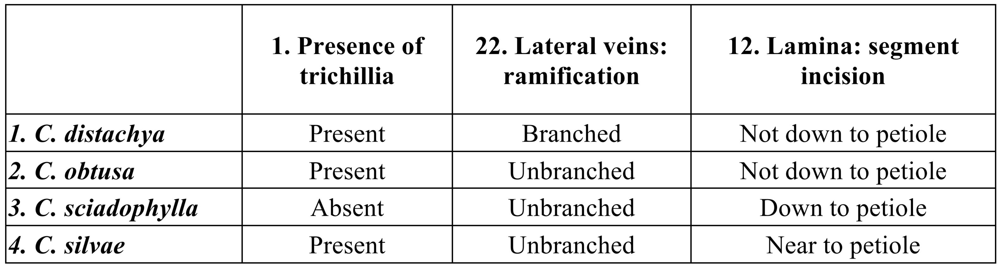
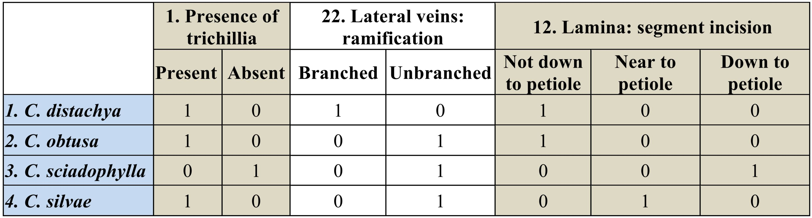
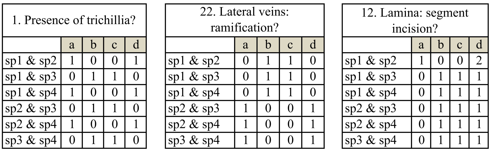
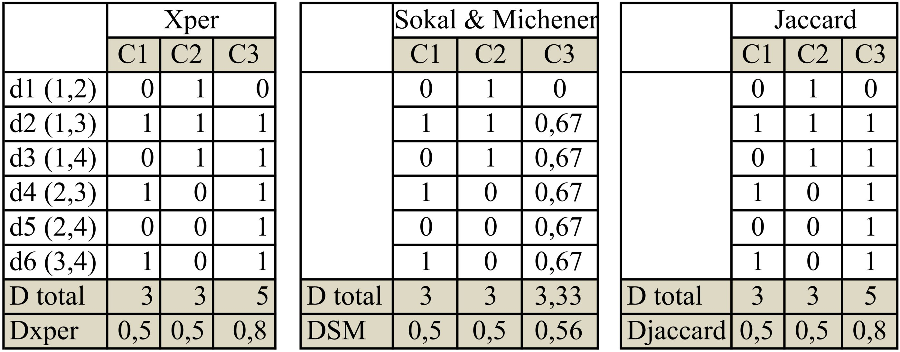
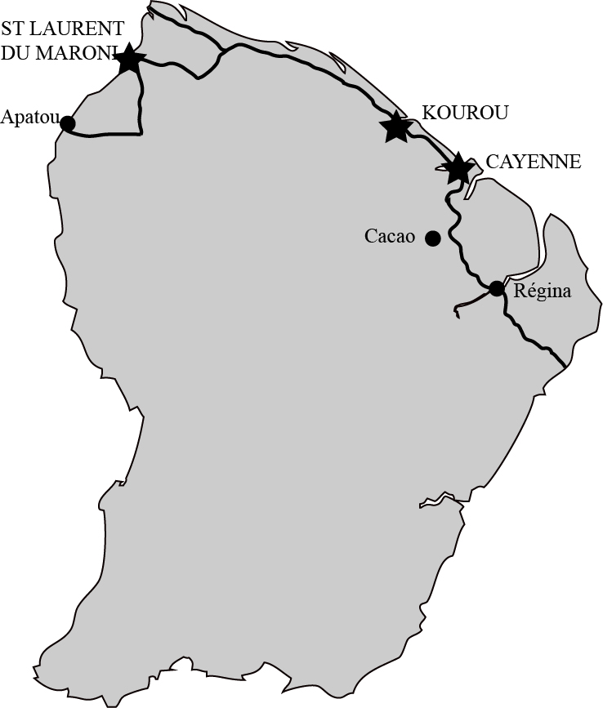

# Matériels et Méthodes
## Construction d’une base de donnée photographique

Une première étape de ce travail a été de regrouper le plus possible d’illustrations disponibles sur *Cecropia* et de les assembler dans une base de donnée sous le logiciel Aperture© [(link)](http://www.apple.com/fr/aperture/). Pour les plantes fraiches, j’ai intégré les photographies des photothèques personnelles de différents botanistes (P. Heuret, P.C. Zalamea, D. Sabatier, M. Kostlin, J. Grosfeld, E. Nicolini) et j’ai moi-même photographié de nombreux spécimens en Guyane Française. J’y ai également intégré plusieurs photographies disponibles sur internet sous une licence « Creative Commons [(link)](http://fr.wikipedia.org/wiki/Creative_Commons)» comme celles publiées par le Field Museum de Chicago [(link)](http://fm2.fieldmuseum.org/plantguides/results.asp?genus=Cecropia). J’ai bénéficié également de photographies de planches d’herbiers prises par P.C. Zalamea dans les herbiers de New-York (NY) et du muséum national de Paris (P). J’ai complété cela avec de nombreuses photographies téléchargées depuis les sites internet des principaux herbiers internationaux [(link)](http://en.wikipedia.org/wiki/Virtual_herbarium) (Kew [(link)](http://apps.kew.org/herbcat/navigator.do), Field Museum [(link)](http://fm1.fieldmuseum.org/vrrc/), Missouri Botanical Gardens [(link)](http://www.tropicos.org/ImageSearch.aspx) ou bien sous Jstor [(link)](http://plants.jstor.org/). Enfin, à l’aide d’un microscope digital KEYENCE VHX-500F, j’ai également pris plusieurs clichés de détails (e.g. types de poils, grain de pollen) sur du matériel frais et sur des spécimens de l’herbier de Cayenne.

J’ai pu ainsi regrouper environ 2200 photographies. Pour la grande majorité de celles-ci, je me suis attelé à les retoucher (ex : amélioration de l’exposition, du contraste) et renseigner l’information associée aux champs IPTC : copyright, lieu (avec si possible les coordonnées GPS), légende, mots-clefs (selon un thesaurus homogène) etc. Ces différentes photographies sont publiées pour l’instant sur le site internet [ici](http://joomeo.com/patrick.heuret) et consultable sous avec le login « `nlxbach` » et le mot de passe « `2jkej6` ».

Cette base de données m’a permis à tout instant de mieux comprendre et de valider les caractères morphométriques proposés par B&FR2005 et d’intégrer des illustrations pertinentes à la clef de reconnaissance multi entrées que j’ai développée sous Xper2. Pour 22 espèces ou j’avais des illustrations suffisamment diversifiées, j’ai réalisé des fiches illustrées pour l’aide à la reconnaissance (Annexe 1).

## Construction d’une base de données relatives aux échantillons d’herbiers sous le logiciel BRAHMS et édition des cartes de répartition des espèces.

Pour réaliser leur travail sur la phénologie de reproduction du genre *Cecropia*, @Zalamea2011 ont récolté les informations relatives à 3306 spécimens d’herbiers le tout portant sur les 35 espèces les plus abondamment récoltées. Après la publication de l’article, P.C. Zalamea a complété ces données pour les 26 espèces restantes (305 spécimens d’herbiers) portant ainsi le nombre d’échantillon total à 3611. Après remaniement, j’ai construit une base de donnée sous le logiciel BRAHMS [(link)](http://herbaria.plants.ox.ac.uk/bol/) dédié à la gestion et l’analyse des collections d’herbiers. Ainsi j’ai pu générer des cartes de repartions pour chacune des espèces sous le logiciel Google Earth© (fichiers .kmz) ainsi que sur le portail GeoCAT [(link)](http://geocat.kew.org/). Durant la durée de mon stage, je n’ai pas eu le temps de recouper et les informations que j’ai compilées dans la base de données photographique et la base de données sur les herbiers compilée par P. C. Zalamea.

## Construction d’une matrice de caractère à partir de l’ouvrage de Berg et Rosselli (2005) et intégration au logiciel Xper2

Dans l’ouvrage de B&FR2005, l’information relative à la morphologie des 61 espèces de *Cecropia* se trouve à deux niveaux : (i) synthétisée dans les clefs dichotomiques que les auteurs proposent par régions en début d’ouvrage et (ii) dans les fiches de description détaillées pour chacune des espèces et (ii). J’ai procédé de manière méthodique en construisant une matrice de caractères morphométriques sur la base de ceux proposés comme discriminant dans la clef dichotomique, puis en complémentant l’information manquante pour certaine espèces ou en rajoutant des caractères à partir des descriptions détaillées pour chaque espèces.

## Construction de la clef interactive multi-entrée sous XPER^2^, une plate-forme dédiée à l’identification assistée par ordinateur

La plate-forme XPER^2^ est développée par l’UMR ‘Laboratoire informatique et systématique (LIS) » à Paris [(link)](http://lis-upmc.snv.jussieu.fr/lis/?q=ressources/logiciels/xper2). Elle s’organe autours de 4 modules principaux:  
(i)	La définition d’un modèle descriptif standardisé qui consiste à lister l’ensemble des caractères ainsi que leur états possibles selon une terminologie unifiée et, éventuellement, des dépendances entre caractère (niveaux de hiérarchie).  
(ii) La description des taxons en renseignant les caractères et leur état tel que précédemment définis. Que ce soit à l’échelle des taxons ou des caractères, il est possible d’y associer des définitions, des commentaires ou description textuelles ainsi que des photographies.  
(iii) Des outils de gestion qui permettent de vérifier la cohérence de la matrice de caractère ou d’éditer divers documents de travail.  
(iv) Une clef d’identification multi-entrées.  
Pour construire cet outil d’identification dédié au genre *Cecropia*, j’ai procédé aux différentes étapes suivantes:   
1. J’ai construit directement ma matrice de caractère sous XPER en désignant les 61 espèces, les caractères et leurs différentes modalités.  
2. J’ai testé la cohérence de cette base de donnée en vérifiant les conflits d’identification pour des plusieurs espèces et cela à partir des photographies contenues dans la base de données que j’ai construite.  
3. Pour chacun des caractères, j’y ai associé des définitions adéquates (issues de différents ouvrages en botanique) ainsi que des illustrations sous formes de schémas ou de photos. Pour cela, j’ai réalisé sous Adobe Illustrator© plusieurs dessins vectoriels adaptés pour rendre compte de la morphologie des *Cecropia*. Pour chacune des espèces j’ai associé plusieurs photographies en essayant de respecter une logique ou les caractères les plus pertinents sont visibles sur les vues choisies.  
J’ai utilisé l’anglais pour nommer les caractères et renseigner les différentes définitions afin de permettre une meilleure diffusion de l’outil et rendre possible son  utilisation conjointe avec l’ouvrage de B&FR2005. Ces caractères et états sont traduits en français dans le texte de ce rapport mais restent en anglais sur les figures obtenues par capture d’écran et dans les tableaux. Pour une meilleure compréhension, j’évoquerai à chaque fois l’indice de numérotation du caractère pour permettre une lecture plus aisée.

## Analyse de la matrice de caractère
### Analyse du pouvoir discriminant des caractères morphométriques
Afin de statuer sur l’information discriminante attachée aux différents caractères j’ai utilisé trois indices proposés directement sous Xper^2^ : (i) l’indice de Jaccard [-@Jaccard1901], (ii) l’indice de Sokal & Michener [-@Sokal1958] et (iii) un indice original « xper2’s index » inspiré des travaux de Lebbe [-@Lebbe1991]. Ces mesures sont des évaluations quantitatives de la capacité que possède un caractère pour distinguer les espèces entre eux. Afin d’illustrer didactiquement la manière dont ces indices sont calculés, je m’appuierait sur un exemple simplifié d’une matrice de caractère ;

Soit 4 espèces décrites selon 3 caractères : (i) 1. la présence de trichilia (avec 2 états ‘absent’ ou ‘présent’), (ii) 22. la présence de nervure tertiaires (avec 2 états ‘absent’ ou ‘présent’) et (iii) 12. Le degré de découpage du limbe en lobe (avec 3 états selon que le limbe est découpé en lobes allant ‘jusqu’au pétiole’, ‘proche du pétiole’ ou ‘avec un partie soudé à la base importante (i.e. ‘Not down to petiole’))  

```{r , echo=FALSE, fig.align = 'center', out.width = '100%'}

```


On transforme cette matrice en tableau disjonctif complet ou les états deviennent des variables codées par des valeurs binaires avec  0 = Absent et 1 = Présent ;

```{r , echo=FALSE, fig.align = 'center', out.width = '100%'}

```

On compare alors deux à deux les espèces en calculant pour l’ensemble des états définis :  
a = le nombre d’états communs à deux espèces ;  
b = le nombre d’états associés à l’espère i mais non associés à l’espèce j ;  
c = le nombre d’états associés à l’espère j mais non associés à l’espèce i ;  
d = le nombre d’états associés ni à l’espèce i, ni à l’espèce j ;  

Dans notre cas avec 3 espèces, 6 comparaisons sont possibles deux à deux :
```{r , echo=FALSE, out.width = '100%'}

```

Pour chaque paire d’espèces, les indices sont calculés de la manière suivante :
**(i) L’indice de Jaccard** est un coefficient d’association connu pour étudier la dissimilarité entre objets pour des données binaires de présence-absence :
$$d_{Jaccard}=\frac{b+c}{a+b+c}$$
**(ii) L’indice de Sokal et Michener** est calculé suivant la formule suivante :
$$d_{SM}=\frac{b+c}{a+b+c+d}$$
Dans ce cas, l’ensemble des états est pris en compte, y compris ceux qui ne sont associé à aucune des espèces considérées.  
**(iii) L’indice Xper^2^** est basé sur l’incompatibilité entre descriptions. Deux espèces sont incompatibles (ou dissimilaires / discriminées) pour un descripteur s'ils n'ont aucun état de caractère possible en commun $a = 0$.  
Formule : $d_{Xper} = 1$ si $a = 0$ ; sinon $d_{Xper} = 0$  
```{r , echo=FALSE, out.width = '100%'}

```
 
### Classification hiérarchique des espèces

J’ai travaillé à partir d’une matrice de caractères comprenant le tableau disjonctif des caractères qualitatifs et les minimas et maximas des caractères continus. Une première étape a été de trouver une solution pour les valeurs manquantes.  
- Depuis la parution de l’ouvrage de B&FR2005 de nouvelles observations ont été faîte (photos, herbiers) et j’ai pu pour *C. silvae* par exemple renseigner des valeurs manquantes.  
- Lorsque une seule espèce ne possédait pas d’information pour un caractère avec peu d’état, j’ai mis la valeur 1 par défaut stipulant ainsi que l’espèce peut potentiellement présenter tous les états.  
- J’ai enlevé des variables concernant les minimas. En effet une longueur de pétiole minimale n’a pour moi que peu de sens puisque cela dépend des stades de développement échantillonnés.  

Enfin, lorsque rien n’était possible, j’ai privilégié l’abandon d’un caractère plutôt que l’abandon d’une espèce. J’ai ainsi travaillé sur une matrice de 61 lignes et 138 colonnes (dont 117 variables binaires et 21 variables continues). J’ai effectué 3 types de classification hiérarchique. La première repose sur une analyse mixte des variables binaires et des variables continues. La métrique choisie pour calculer la distance sur les variables binaires est celle de Dice [-@Dice1945] tandis que c’est celle de Gower [-@Gower1971] choisie pour les variables continues. La classification hiérachique est construite selon la méthode UPGMA (**U**nweighted **P**air **G**roup **M**ethod with **A**rithmetic Mean). Pour les deux suivantes, j’ai travaillé séparément soit sur les variables binaires (Fig. \@ref(fig:fig10b), indice de Dice, méthode UPGMA), soit sur les variables continues (Fig. \@ref(fig:fig10c), distance euclidienne, méthode UPGMA) ce qui a permis de faire un test de bootstrap pour vérifier la robustesse des différents nœuds de l’arbre (1000 répétitions). Les analyses ont été effectuées avec le logiciel PAST (PAlaeontological STatistics) [@Clarke1993] 

## Etude de cas en Guyane française

Finalement, cette clef a été testée sur le terrain en Guyane Française (Fig. \@ref(fig:fig4)) ou 7 espèces de *Cecropia* sont censées être présentes : *C. obtusa, C. sciadophylla, C. palmata, C. distachya, C. silvae, C. latiloba* et *C. granvilleana* (Boggan et al. 1997 données de l’herbier de Cayenne). J'ai essentiellement prospecté (i) dans l’ouest de la Guyane, sur la route St-Laurent du Maroni-Apatou qui a été récemment ouverte en 2006, (ii) dans l’ouest, sur la piste forestière de la Mataroni sur la route Régina-St-Georges et (iii) vers Iracoubi, sur la piste forestière de Counami. J’ai eu l’occasion d’observer toutes les espèces en dehors de *C. granvilleana*. Il n’existe que 4 échantillons au monde pour cette espèce qui pousse sur les inselbergs. Je l’ai cherché à Savanne-Roche virginie (N4°11'03,8'' W52°08'07,4'') sans succès. J’ai pu ainsi tester ma clef multi-entrées sur de nombreux morphotypes et je présenterai les limitations que j’ai rencontrées dans la partie « Résultats ». Ces observations m’ont permis de mener une réflexion sur la mise au point de protocole d’observation et de prise de vue photographique formaté pour une prise de données pertinente et homogène par le plus grand nombre.

(ref:fig4) La carte de Guyane Française et la nouvelle route de Apatou à Régina 

```{r fig4, echo=FALSE, fig.cap='(ref:fig4)', fig.align = 'center', out.width = '70%'}

```
\pagebreak
