# Résultat
##  La base de donnée de *Cecropia*
A partir de l’ouvrage de B&FR2005 j’ai retenu 59 caractères morphométriques que j’ai divisé 9 grandes classes selon la partie de la plante concernée : (i) le trichilium – 9 caractères, (ii), le limbe – 16 caractères, (iii) le pétiole – 3 caractères, (iv) la calyptre – 6 caractères, (v) l’inflorescence mâle – 7 caractères, (vi) l’inflorescence femelle – 7 caractères, (vii) la spathe – 6 caractères, (viii) le fruit – 3 caractères et (ix) la tige – 2 caractères. A cela j’ai rajouté un 60ème caractère (qui constitue la 10ème classe) concernant la localisation géographique et qui est le point d’entrée de la clef dichotomique de B&FR2005. 39 caractères correspondent à des variables catégorielles pour un total de 191 états. Les 20 caractères restant correspondent à des variables numériques. 50 des caractères correspondent à ceux utilisés par B&FR2005 dans leurs clefs de début d’ouvrage. J’ai rajouté à cela 10 caractères à partir des descriptions détaillées qu’ils ont fait pour chaque espèce et qu’ils n’ont apparemment pas jugé utile d’utiliser comme caractères discriminants (voir le détail en Annexe 2). L’ouvrage de B&FR2005 ne m’a pas permis de renseigner l’ensemble de ces caractères pour les 61 espèces et la matrice est renseignée à 77.46 %.

## Notice d’utilisation de la clef multi-entrée : l’exemple de *C. distachya*
En mode `identification`, la clef que j’ai développée sous Xper2 se présente de la manière suivante (Fig. \@ref(fig:fig5)): dans la sous-fenêtre (A) se trouve la liste des caractères morphométriques. Il est possible de les filtrer par groupes et de les classer selon les valeurs des indices Xper, Jaccard ou Sokal & Michener. J’ai rajouté un groupe appelé ‘je propose’ avec les caractères que j’ai jugé comme les plus pertinents quelque soit la partie de la plante qu’ils concernent (le choix de ces caractères sera discuté par la suite). Dans la sous-fenêtre (B), se trouvent les différents états possibles du caractère sélectionné. J’ai illustré la plupart des caractères et leurs états possibles avec des dessins ou des photographies (D) et j’y ai associé une définition dans la majorité des cas (C) Dans la sous-fenêtre (E) figure la liste des 61 espèces qui sont conformes aux critères sélectionnés. Dans la sous-fenêtre (F), figurent les espèces qui ne sont pas conformes aux critères sélectionnés. 

(ref:fig5) : Interface d’indentification du logiciel XPER2_Cecropia (A. Liste des caractères pertinants pour l’identification; B. Liste des états correspondants au caractère sélectionné en A; C. Définitions des caractères; D. Illustrations des états de caractères; E. Liste des taxons correspondants aux états de caractères sélectionnés; F. Liste des taxons qui ne correspondent pas aux états de caractère choisis) 
 
```{r fig5, echo=FALSE, fig.cap='(ref:fig5)', fig.align = 'center', out.width = '90%'}
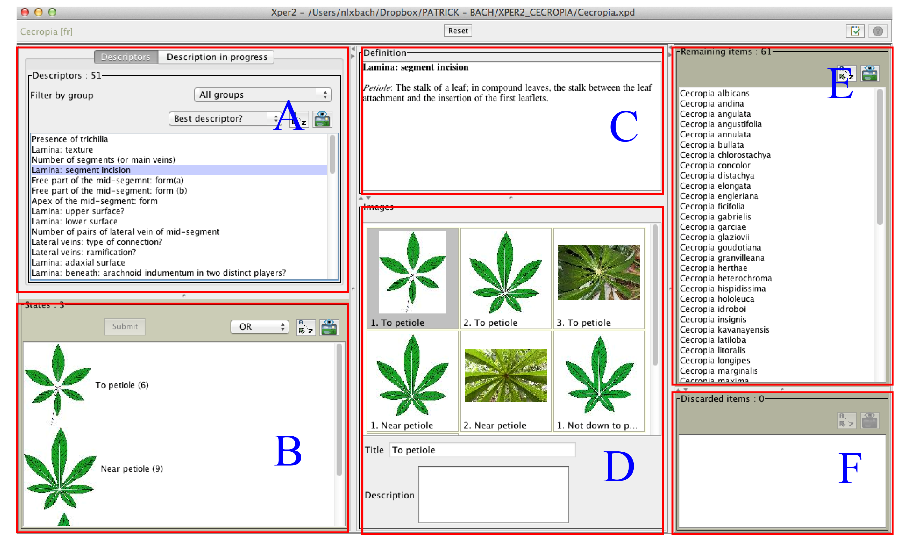
```
En double-cliquant sur une espèce on accède à une fiche détaillée avec (i) la description textuelle de B&FR2005, (ii) un ensemble d’illustrations judicieusement choisies dans la photothèque que j’ai construite et (iii) la description formatée pour l’ensemble des caractères renseignés dans la matrice et rassemblés selon les groupes définis (Fig. \@ref(fig:fig6)). Si l’espèce sur laquelle on clique se trouve parmi la liste de celles qui ne sont pas retenues dans la description courante (sous-fenêtre F) alors les caractères qui ne sont pas en accord avec les choix effectués apparaissent en rouge. En sélectionnant plusieurs espèces dans les fenêtres (E) ou (F) et en faisant clique-droit > `Comparaison` on visualise la matrice de caractère avec les critères qui sont discriminants pour les espèces sélectionnées. Avec clique-droit > `Particularité(s)` ont obtient une liste des états possédés uniquement par les espèces choisies.  

(ref:fig6) : Une fiche détaillée avec (i) la description textuelle de B&FR2005, (ii) un ensemble d’illustrations et (iii) la description formatée pour l’ensemble des caractères renseignés dans la matrice et rassemblés selon les groupes définis. 
 
```{r fig6, echo=FALSE, fig.cap='(ref:fig6)', fig.align = 'center', out.width = '70%'}
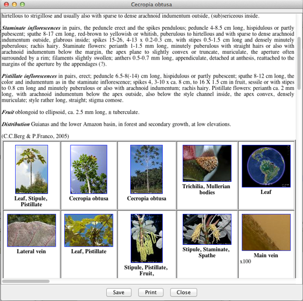
```

En l’état actuel, 470 images et illustrations sont associées aux différentes descriptions (caractères, états, espèces). A titre d’exemple d’utilisation, je prendrais la planche d’herbier présentée Fig.  \@ref(fig:fig7). Sur cette photographie, **13 caractères** morphométriques sont observables:

1) L’inflorescence mâle comporte 10 épis ; En renseignant **« 35. Staminate spikes: number» = 10** alors 34 espèces sont exclues. 27 espèces restent en course et sont potentiellement celles que l’on cherche à identifier.
2) Le nombre de lobes  est de 8 ; En renseignant **« 11. Number of segment (or main vein) » = 8** alors 8 espèces supplémentaires sont exclues et 19 espèces restent en course.
3) Le plus grand épi possède un diamètre de 3 mm ; En renseignant  **« 40. Staminate spikes: maximal diameter» = 3** alors 6 espèces supplémentaires sont exclues et 13 espèces restent en course.
4) Les nervures secondaires sont connectées ensembles sur la marge du limbe ; En renseignant **« 21. Lateral veins: type of connection » > ‘Marginally’** alors 6 espèces supplémentaires sont exclues et 7 espèces restent en course.
5) Les nervures secondaires portent des nervures tertiaires ; Ce caractère n’est pourtant visible que sur le lobe situé le long du pétiole ce qui pourrait être une sorte d’anomalie (en fait, dans le cas de cette espèce, c’est plutôt le fait que ce caractère soit si peu marqué qui en est une) ; En renseignant **« 22. Lateral veins: ramification » > ‘Branched’** alors deux espèces supplémentaires sont exclues. Face à l’ambigüité du spécimen nous décidons de ne pas renseigner ce critère.
6) Le pétiole mesure 22.4 cm ; En renseignant **« 26. Petiole : length » = 22.4** alors deux espèces supplémentaires sont exclues et 5 restent en course
7) Le plus grand épi mesure environ 8.5 cm de longueur ; En renseignant **« 39. Staminate spikes: maximal length» = 8.5** alors une nouvelle espèce est écartée. 4 espèces restent en course. 
8) Les lobes sont entiers dans le sens ou ils ne sont pas redécoupé eux-mêmes en `feuille de chêne` ; En renseignant **« 14. Free part of the mid-segment: form(a)” > ‘Entire’** alors une nouvelle espèce est écartée et 3 espèces restent en course. 
9) La partie libre du lobe principal est plutôt d’une forme obovale, c’est à dire que la largeur maximale se trouve au delà de la partie médiane ; En renseignant **« 16. Free part of the mid-segment: form(b)” > ‘Obovate’** alors une nouvelle espèce est écartée et 2 espèces restent en course. 

(ref:fig7) : Photographie  d’échantillon d’herbier *C. distachya* (KEW-K000512374). 13 caractères morphométriques sont observables. 
 
```{r fig7, echo=FALSE, fig.cap='(ref:fig7)', fig.align = 'center', out.width = '100%'}
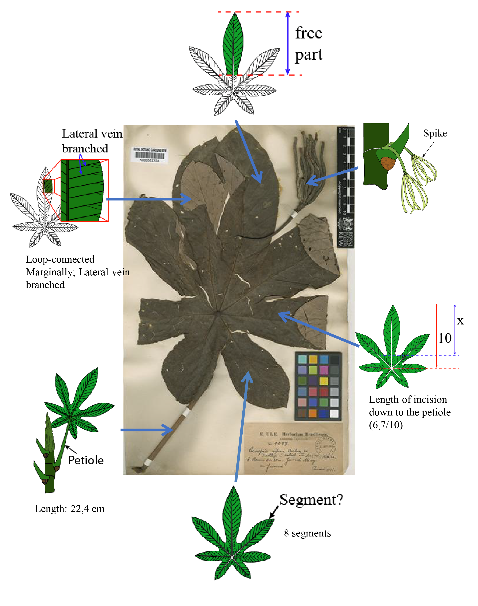
```

A ce stade, les 4 derniers critères observables ne permettent pas d’affiner la recherche : 10. On compte environ 16 paires de nervures secondaires sur la partie libre du lobe principal : « 20. Number of pairs of lateral veins in the mid-segment » = 16 ; 11. Les lobes sont soudés à leur base et ne sont pas libre jusqu’à leur insertion sur le pétiole : **« 12. Lamina: segment incision » > ‘Not down to petiole’**; 12. Le lobe principal mesure environ 22.2 cm. La partie soudée représente 7.4 cm tandis que la partie libre représente 14.8 cm. La partie libre représente ainsi 6.7/10 de la longueur totale du lobe : **« 13. Free part of the mid-segment length/Total mid-segment length ratio» = 6.7**; 13. Le pédoncule de l’inflorescence mesure environ 9.4 cm de long: **« 38. Staminate inflorescence: peduncle length » = 9.4**. 

Les deux espèces sont *C. distachya* et *C. obtusifolia* (Fig. \@ref(fig:fig8)). Notons qu’à ce stade le critère **« 22. Lateral veins: ramification? »** n’est pas discriminant puisque ces deux espèces sont censées avoir des nervures tertiaires. En sélectionnant les deux espèces et en faisant clique-droit > `comparaison` nous pouvons voir les critères qui permettent de les séparer. Seul le type de stigmate ne laisse aucune ambigüité mais il n’est malheureusement pas observable sur cet échantillon mâle. Avec cet unique échantillon, il est donc impossible de trancher entre ces deux espèces. Par contre, l’étiquette indique que ce spécimen a été collecté au Brésil sur le Rio Juruá un des principaux affluents de l’amazone dans l’état de l’Amazonas. En choisissant le critère de la position géographique : **« 60. Location » > ‘Amazonian Brazil’** alors une espèce unique est sélectionnée : *C. distachya* ce qui est effectivement la détermination attribuée à cet échantillon (*C. riparia* étant un synonyme de *C. distachya*). A noter que dans le processus que nous avons décrit ci-dessus, si la position géographique avait été entrée en tant que premier critère, l’espèce aurait été identifié dès que le quatrième critère aurait été renseigné (**« 21. Lateral veins: type of connection? »**). 

(ref:fig8) XPER2 propose 2 espèces *C. distachya* et *C. obtusifolia* qui ont les caractères compatibles avec les 13 caractères observés sur  l’échantillon d’herbier montré Fig.  \@ref(fig:fig7) 
 
```{r fig8, echo=FALSE, fig.cap='(ref:fig8)', fig.align = 'center', out.width = '100%'}
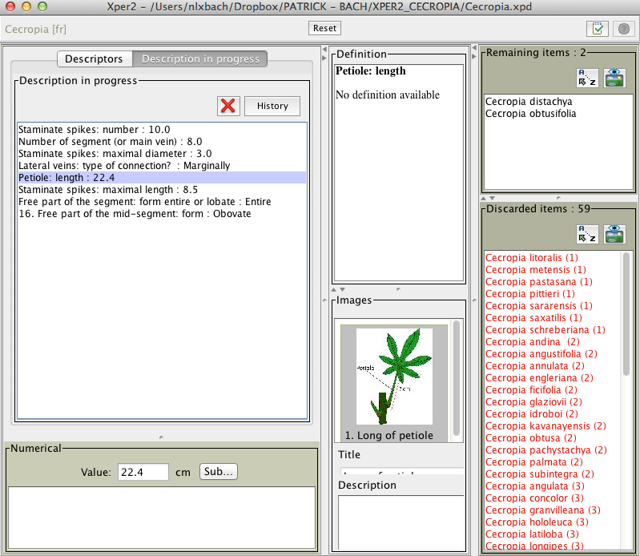
```


Comparons cette démarche avec celle suivie dans B&FR2005 au travers de la clef dichotomique (Fig. \@ref(fig:fig9) ) : En dehors du critère géographique qui est le premier point d’entrée, on notera que : (i) Pour le critère n°2, les trichilias ne sont pas observables sur notre échantillon mais le fait que les lobes ne sont pas découpés jusqu’à leur insertion sur le pétiole nous permet de faire un choix ; (ii) Le dernier critère relatif au statut érigé ou pendant de l’inflorescence n’est pas observable. En suivant la clef de B&FR2005 deux espèces potentielles seraient retenues : *C. palmata* et *C. distachya*. Dans notre identification par Xper2, *C. palmata* avait été écarté car chez cette espèce (i) le nombre d’épis mâles par inflorescence varie entre 4 et 6 et (ii) Le diamètre des épis mâle varie entre 8 et 18 cm. Pour cet exemple, nous arrivons donc à identifier l’espèce avec 5 critères (dont la position géographique) tandis que avec l’utilisation de cette clef dichotomique, le renseignement de 7 critères nous amène à un dilemme entre deux espèces.

(ref:fig9) : XPER2 propose 2 espèces *C. distachya* et *C. obtusifolia* qui ont les caractères compatibles avec les 13 caractères observés sur  l’échantillon d’herbier montré Fig.  \@ref(fig:fig7) 
 
```{r fig9, echo=FALSE, fig.cap='(ref:fig9)', fig.align = 'center', out.width = '100%'}
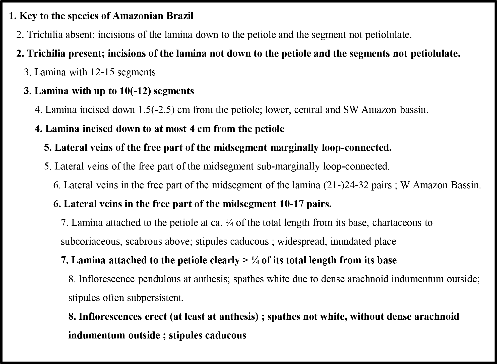
```

## Analyse discriminante des caractères selon différents indices de dissimilarité
Les différents indices de dissimilarité utilisés n’ont de sens que lorsqu’ils traitent des caractères de même type. Nous avons donc travaillé sur deux groupes de caractères selon qu’ils étaient numériques ou catégoriels  

En ce qui concerne les caractères numériques (Tab. \@ref(tab:tab1)), les indices de Jaccard et de Sokal & Michener ne montrent aucune différence. Si l’on prends comme seuil, la moitié de l’indice maximal, 9 variables sont sélectionnées avec l’indice Xper (au delà du seuil de 0.28 ; en bleu). Ces 9 variables sont également sélectionnées avec les indices de Jaccard / Sokal & Michener (au delà du seuil de 0.50) ainsi que 6 variables supplémentaires (en vert). Parmi ces critères, « 26. Petiole: length » et « 46. Pistillate spikes: maximal diameter» sont des critères non utilisé par B&FR2005 dans leurs clefs dichotomiques et pourtant pertinents.  

En ce qui concerne les caractères catégoriels (Tab. \@ref(tab:tab2)), si l’on prends comme seuil, la moitié de l’indice maximal, 11 variables sont sélectionnées avec l’indice Xper (au delà du seuil de 0.26 ; en bleu). Ces 9 variables sont également sélectionnées avec les indices de Jaccard et de Sokal & Michener (au delà du seuil de 0.40 et 0.25 respectivement). L’indice de Jaccard amène à considérer 9 variables supplémentaires (en vert). L’indice de Sokal & Michener amène à considérer 11 variables supplémentaires, dont deux non retenues par l’indice de Jaccard (en orange). Parmi ces critères, « 57. Fruit: surface», « 56. Fruit: form» et « 17. Apex of the mid-segment: form » sont des critères non utilisés par B&FR2005 dans leurs clefs dichotomiques et pourtant pertinents.  

La plupart des ces critères sont observables sur un minimum de photographie que l’on peut prendre aisément sur le terrain. Dans l’Annexe 3, je propose un ensemble de vues (compilées à partir de différentes espèces) que pourraient prendre n’importe quel néophyte et qui permettrait à priori d’identifier l’espèce. Les caractères importants et qui restent difficile à saisir sur une photographie sans un examen attentif du spécimen sont « 48. Stigma: type », « 57. Fruit: surface », « 10. Lamina: texture » (ex : coriace, chartacée), « 56. Fruit: form » et « 18. Lamina: upper surface « (ex : glabre, pubérulant). En plus de ce protocole photographique que je propose, je propose pour des contributeurs plus confirmés une feuille type comportant les caractères à observer et à renseigner ainsi qu’une illustration de ces caractères (Annexe 4). Les critères concernant les poils sont réduit à la simple observation d’un indumentum arachnoïde sur le pétiole ; en effet la terminologie concernant la pilosité adoptée par B&FR2005 comporte de nombreux états dont nous n’avons pas toujours saisi les nuances.  

```{r include=FALSE}
library(magrittr)
library(knitr)
library(kableExtra)
```

```{r eval=FALSE, include=FALSE}
tab1 <- read.csv("table/tab1.csv", stringsAsFactors = F)
col <- "#0a7502"
tab1$Liste.caracteres[c(10:12,14,16,17)] <- cell_spec(tab1$Liste.caracteres[c(10:12,14,16,17)], color = col)
tab1$Jaccard[c(11,12,14,16,17)] <- cell_spec(tab1$Jaccard[c(11,12,14,16,17)], color = col)
tab1$Sokal.Michener[c(11,12,14,16,17)] <- cell_spec(tab1$Sokal.Michener[c(11,12,14,16,17)],color = col)
tab1$XPER[1] <- cell_spec(tab1$XPER[1], bold = T)
tab1$Jaccard[c(1:3,6,9)] <- cell_spec(tab1$Jaccard[c(1:3,6,9)], bold = T)
tab1$Sokal.Michener[c(1:3,6,9)] <- cell_spec(tab1$Sokal.Michener[c(1:3,6,9)], bold = T)
tab1$Jaccard[10] <- cell_spec(tab1$Jaccard[10], bold = T,color = col)
tab1$Sokal.Michener[10] <- cell_spec(tab1$Sokal.Michener[10], bold = T,color = col)
```

```{r eval=FALSE, include=FALSE}

tab2 <- read.csv("table/tab2.csv", stringsAsFactors = F)
line_green <- c(12,13,15:18,20,25,27)
line_red <- c(14,23)
tab2$Liste.caracteres[line_green[-c(8,9)]] <- cell_spec(tab2$Liste.caracteres[line_green[-c(8,9)]], color = col)
tab2$Jaccard[line_green] <- cell_spec(tab2$Jaccard[line_green], color = col)
tab2$Sokal.Michener[line_green[-2]] <- cell_spec(tab2$Sokal.Michener[line_green[-2]], color = col)
col2 <- "red"
tab2$Liste.caracteres[line_red] <- cell_spec(tab2$Liste.caracteres[line_red], color = col2)
tab2$Sokal.Michener[c(line_red,26)] <- cell_spec(tab2$Sokal.Michener[c(line_red,26)], color = col2)
tab2$XPER[1] <- cell_spec(tab2$XPER[1], bold = T)
tab2$Jaccard[3] <- cell_spec(tab2$Jaccard[3], bold = T)
tab2$Sokal.Michener[5] <- cell_spec(tab2$Sokal.Michener[5], bold = T)
```
```{r tab1, echo=FALSE}
knitr::kable(tab1,escape = F,
	caption = "Liste des caractères numériques et leur indice de dissimilarité calculés dans XPER2. Les valeurs en gras indiquent les valeurs maximales par indice utilisé") %>% 
  kable_styling("striped", full_width = F) %>% 
  column_spec(1,width = "25em") %>% 
  row_spec(1:9, color = "#0072ff") %>% 
  row_spec(0, bold = T)
```


```{r tab2, echo=FALSE}

knitr::kable(tab2,escape = F,
	caption = "Liste des caractères catégoriels et leur indice de dissimilarité calculés dans XPER2. Les valeurs en gras indiquent les valeurs maximales par indice utilisé.") %>% 
  kable_styling(full_width = F,"striped") %>% 
  column_spec(1,width = "25em") %>% 
  row_spec(1:11, color = "#0072ff") %>% 
  row_spec(0, bold = T)
```


## Comparaison des espèces via une classification ascendante hiérarchique 
La première classification est mixte et intègre aussi bien les caractère qualitatifs qui sont ici binarisé (les états sont devenu les caractères) que les caractères quantitatifs exprimés au travers d’une valeur minimal et maximale (Fig. \@ref(fig:fig10a)). Les deux autres classifications concernent soit les variables binaires (Fig. \@ref(fig:fig10b)), soit les variables continues (Fig. \@ref(fig:fig10c)). Les coefficients de corrélation pour ces 3 classifications sont respectivement de 0.699, 0.6953, 0.8911. Les tests de Bootstrap montrent cependant une robustesse toute relative des classifications.

On remarque entre autre la grande proximité entre *C. concolor* et *C. engleriana*. Pour ces deux espèces nous n’avons effectivement aucun critère qui permet de les discriminer complètement. *C. engleriana* possède un nombre de paire de veines sur la partie libre du segment principal plus élevée que *C. concolor* (respectivement 24-32 vs. 16-24) et des épis mâles et femelles un peu plus longs. 

(ref:fig10a) : Classification Ascendante Hiérarchique (CAH) selon la méthode UPGMA (**U**nweighted **P**air **G**roup **M**ethod with **A**rithmetic Mean) incluant les caractères quantitatifs  et qualitatifs. 
 
```{r fig10a, echo=FALSE, fig.cap='(ref:fig10a)', fig.align = 'center', out.width = '100%'}
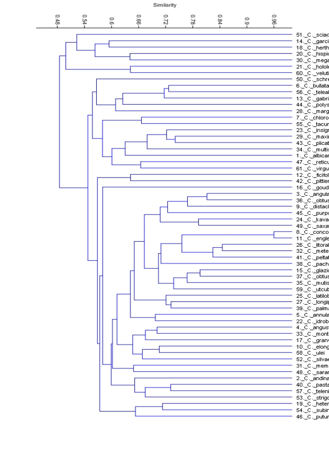
```
(ref:fig10b) : Classification Ascendante Hiérarchique (CAH) selon la méthode UPGMA (**U**nweighted **P**air **G**roup **M**ethod with **A**rithmetic Mean) pour les caractères qualitatifs. 
 
```{r fig10b, echo=FALSE, fig.cap='(ref:fig10b)', fig.align = 'center', out.width = '100%'}
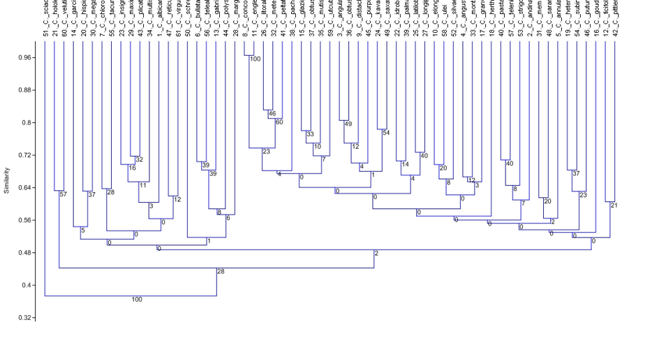
```
(ref:fig10c) : Classification Ascendante Hiérarchique (CAH) selon la méthode UPGMA (**U**nweighted **P**air **G**roup **M**ethod with **A**rithmetic Mean) pour les caractères quantitatifs. 
 
```{r fig10c, echo=FALSE, fig.cap='(ref:fig10c)', fig.align = 'center', out.width = '100%'}
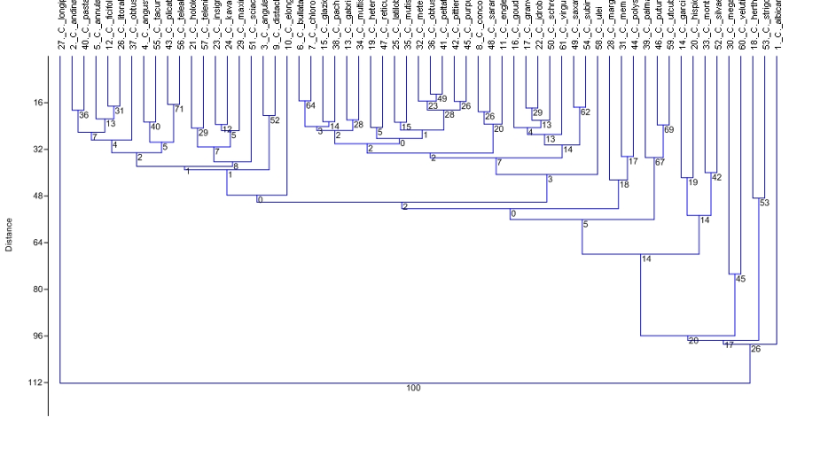
```
## La diversité des espèces Guyanaise : études de cas.
Dans la plupart des cas, je n’ai eu aucun mal à identifier les différentes espèces de Guyane avec ma clef multi-entrée. L’espèce la plus stable du point de vue des traits morphométriques est sans aucun doute *C. sciadophylla*. Cependant, plusieurs problèmes ont été rencontrés et certains morphotypes restent non identifiés. 

**Cas n°1** – La Figure \@ref(fig:fig11) montre un spécimen photographié par D. Sabatier en novembre 2011 sur la piste forestière de la Mataroni (N 04°06'13,9" W 52°04'40,1", Herbier Sabatier D., Smock J.-L. & Tarcy M. 5805, CAY). 11 caractères morphométriques sont observables/mesurables. Alors que l’ensemble de ces critères nous amène à identifier *C. distachya* sans avoir besoin de renseigner la localisation géographique, la présence de 6 épis par inflorescence contredit ce diagnostic. Pour B&FR2005, le nombre d’épis femelles varie de 2 à 4. Cette fourchette a été établie à partir de l’observation de 45 échantillons dont deux seulement provenait de la Guyane française. Face au faible nombre d’échantillon observé par B&FR2005 et au fait que tous les critères semblent désigner *C. distachya* en dehors du nombre d’épis femelles, nous concluons que l’identification est exacte mais que la variabilité de ce critère est sous-estimé dans l’ouvrage de B&FR2005. Nous avons été confronté au même genre de cas (1 ou 2 caractères non conformes aux fourchettes établies par B&FR2005) pour un échantillon mâle de *C. distachya* (avec un nombre d’épis trop peu élevé et des pétioles trop longs), un échantillon stérile de *C. silvae* (avec des lobes légèrement soudés à leur base) et un échantillon de *C. obtusa* (avec des nervures tertiaires). 

**Cas n°2** – La Figure \@ref(fig:fig12) montre un spécimen stérile photographié par P. Heuret en mars 2011 sur la piste forestière de Counami (N5°21'33'' W53°12'49'', Herbier Heuret n° 123, CAY). 10 caractères morphométriques sont observables/mesurables. Cette description n’amène à aucune espèce parmi les 61 décrites. Plusieurs critères entrent à chaque fois en conflit. L’espèce les plus proche de cette description est *C. angustifolia*. Cependant, celle-ci possède un indumentum arachnoïde sur le pétiole alors que dans ce cas le pétiole est  glabre. Mais surtout l’échantillon collecté le plus proche de la Guyane se trouve au Vénezuela à 1700 km. Si l’on regarde les espèces attendues en Guyane Française, les plus proche sont *C. sciadophylla* et *C. silvae*. Mais *C. sciadophylla* (i) ne présente cependant pas de trichilium, (ii) les lobes sont découpés jusqu’à leur base et s’insèrent directement sur le pétiole et (iii) il n’y a pas de nervures tertiaires ; ces critères sont ici pourtant clairement exprimés. Quand à *C. silvae*, les différences avec cet échantillon sont nombreuses : (i) il possède un indumentum pubérulent ou hirsute sur le pétiole, (ii) Le nombre de lobes est plus élevé et va de 15 à 20 alors que nous en observons 11, (iii) Le nombre de nervures latérales est également plus élevé et va de 40 à 58 alors que nous en observons 32 paires et (iv) il n’y a pas de nervures tertiaires. Cet échantillon n’est donc conforme à aucune espèce déjà décrite. Après prospection à l’endroit où il a été récolté, nous n’avons pas été capable de retrouver un morphotype similaire. 

**Cas n°3** – Le spécimen que j’ai photographié en avril 2012 sur la route entre Saint-Laurent du Maroni et Apatou; N5°14’54.3’’ W54°15’48.3’’ Herbier Heuret&Nguyen n° 127, CAY (Fig. \@ref(fig:fig13)). A partir de la clef de B&FR2005 j’arrive à un choix entre *C. obtusa* et *C. peltata*. Après avoir renseigné 17 caractères avec ma clef multi-entrées, ces deux espèces sont écartées car elles sont incompatibles avec 5 et 3 caractères respectivement. Par contre, j’arrive à une proposition qui est *C. obtusifolia*. Nous sommes par contre bien loin de son aire de répartition puisqu’elle se trouve sur la cordillère des Andes en Equateur et Colombie ainsi Amérique centrale. Je précise cependant que je n’ai pas observé la forme du stigmate qui est un caractère important.

(ref:fig11) : Le spécimen photographié par D. Sabatier en novembre 2011 sur la piste forestière de la Mataroni (N 04°06'13,9" W 52°04'40,1", Herbier Sabatier D., Smock J.-L. & Tarcy M. 5805, CAY) 
 
```{r fig11, echo=FALSE, fig.cap='(ref:fig11)', fig.align = 'center', out.width = '80%'}
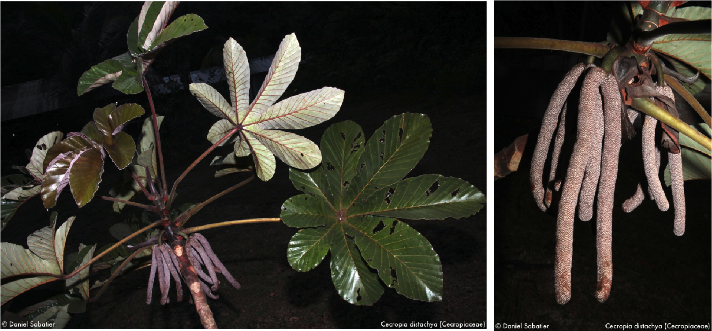
```

(ref:fig12) : Le spécimen stérile photographié par P. Heuret en mars 2011 sur la piste forestière de Counami (N5°21'33'' W53°12'49'', Herbier Heuret n° 123, CAY)  
 
```{r fig12, echo=FALSE, fig.cap='(ref:fig12)', fig.align = 'center', out.width = '80%'}
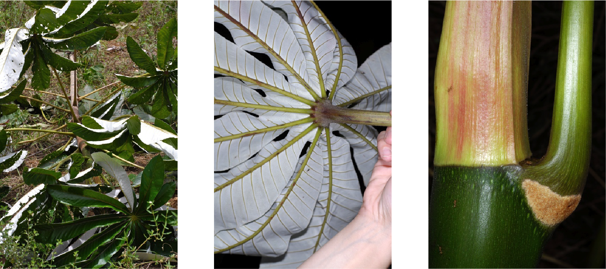
```

(ref:fig13) : Le spécimen que j’ai photographié en avril 2012 sur la route entre Saint-Laurent du Maroni et Apatou; N5°14’54.3’’ W54°15’48.3’’; Herbier Heuret&Nguyen n° 127, CAY. 
 
```{r fig13, echo=FALSE, fig.cap='(ref:fig13)', fig.align = 'center', out.width = '80%'}
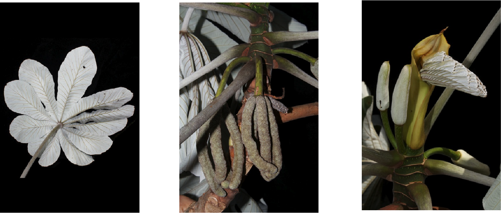
```
\pagebreak
